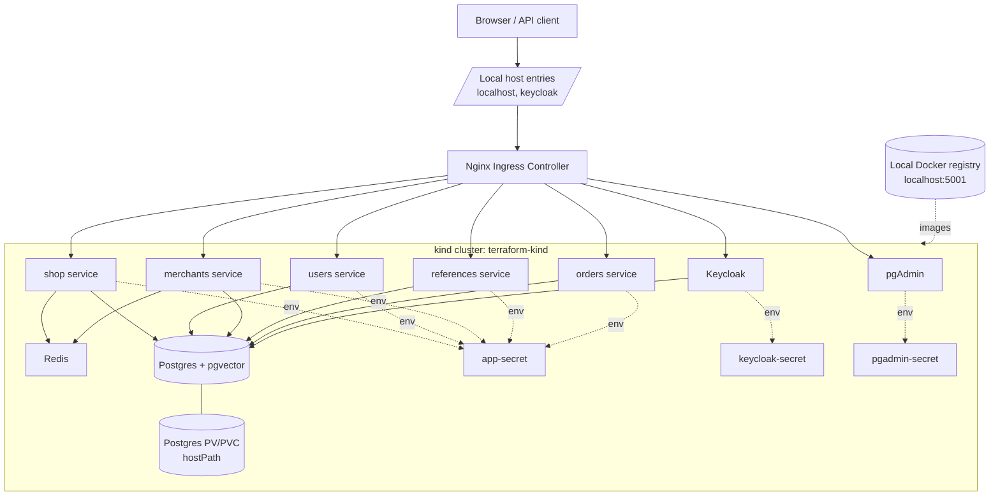
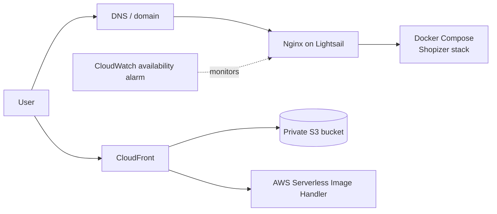

# Shopizer Kubernetes and Infrastructure

This page describes the infrastructure used to run the Shopizer microservices stack locally on Kubernetes, and the AWS infrastructure available for a low-cost hosted deployment.

The local platform is provisioned with Terraform, Docker, kind, kubectl, and a Python runbook. Terraform creates the local container registry, generates the kind cluster configuration, builds and loads the Shopizer images, and applies the Kubernetes manifests.

## Architecture



## Local Infrastructure

| Component | Purpose | Configuration |
| --- | --- | --- |
| Docker Desktop | Runs kind nodes, the local registry, and buildpack image builds. | Required before Terraform or the runbook executes. |
| Terraform | Orchestrates local infrastructure and Kubernetes manifest deployment. | Main module: `shopizer-local/main.tf`. |
| Python runbook | Runs the preferred end-to-end installation and verification flow. | `python -u runbook.py shopizer-local-runbook.yaml`. |
| kind | Provides the local Kubernetes cluster. | Cluster name: `terraform-kind`. |
| Local registry | Stores built microservice images before kind pulls them. | Container: `kind-registry`, host port: `5001`, internal port: `5000`. |
| kubectl | Applies manifests and operates the cluster. | Used by Terraform, the runbook, and operation scripts. |
| Java 21 | Builds the Shopizer Spring Boot images. | Required by `build.sh` and hot redeploy operations. |

The kind cluster maps HTTP and HTTPS traffic from the host into the control-plane node:

| Host port | Container port | Purpose |
| --- | --- | --- |
| `80` | `80` | Local ingress HTTP traffic. |
| `8443` | `443` | Local ingress HTTPS traffic. |

Postgres data is persisted through a kind host mount. Terraform creates the configured host directory and injects it into `kind-config.generated.yaml`, where it is mounted into the kind node at `/postgres-data`.

## Kubernetes Workloads

The local cluster runs the following application workloads in the `default` namespace.

| Deployment | Image | Service | Container ports | Purpose |
| --- | --- | --- | --- | --- |
| `shop` | `localhost:5001/shopizer-shop:latest` | `shop:80` | `8080`, `5008` | Storefront/API service. Uses Postgres, Redis, Keycloak, and optional OpenAI API key. |
| `users` | `localhost:5001/shopizer-users:latest` | `users:80` | `8080`, `5007` | User and identity-related application service. Calls Keycloak and merchants. |
| `merchants` | `localhost:5001/shopizer-merchants:latest` | `merchants:80` | `8080`, `5005` | Merchant service. Uses Postgres, Redis, and Keycloak. |
| `references` | `localhost:5001/shopizer-references:latest` | `references:80` | `8080` | Reference data service. Uses Postgres and Keycloak. |
| `orders` | `localhost:5001/shopizer-orders:latest` | `orders:80` | `8080` | Order service. Uses Postgres, Keycloak, and optional OpenAI API key. |

Each service has one replica by default. The manifests are intentionally small and local-development oriented, with image tags pointing to the local registry.

## Platform Services

| Component | Kubernetes object | Image | Service | Purpose |
| --- | --- | --- | --- | --- |
| Postgres | `deployment/postgres` | `pgvector/pgvector:pg16` | `postgres:5432` | Main relational database. Initializes `shop` and `keycloak` databases. |
| Redis | `deployment/redis` | `redis:7-alpine` | `redis:6379` | Cache/service dependency for selected Shopizer services. |
| Keycloak | `deployment/keycloak` | `shopizerecomm/keycloak:4.0.1.2` | `keycloak:80` | Identity provider for the Shopizer realm and clients. |
| pgAdmin | `deployment/pgadmin` | `dpage/pgadmin4` | `pgadmin:80` | Browser-based Postgres administration. |
| ingress-nginx | `deployment/ingress-nginx-controller` | Upstream kind ingress manifest | Host port `80` | Routes local HTTP requests into the cluster. |

Postgres initialization creates:

| Database | Purpose |
| --- | --- |
| `shop` | Main Shopizer application database. |
| `keycloak` | Keycloak database. |

The `shop` database enables the `vector` and `pg_trgm` extensions for vector search and text search support.

## Ingress Routes

The local ingress is defined in `k8s/ingress/ingress.yaml`.

| Host | Path | Backend service |
| --- | --- | --- |
| `localhost` | `/` | `pgadmin:80` |
| `localhost` | `/shop` | `shop:80` |
| `localhost` | `/users` | `users:80` |
| `localhost` | `/merchants` | `merchants:80` |
| `localhost` | `/references` | `references:80` |
| `localhost` | `/orders` | `orders:80` |
| `keycloak` | `/keycloak` | `keycloak:80` |

Keycloak expects the frontend URL to resolve as `http://keycloak/keycloak`. Add this host entry on the workstation running the stack:

```txt
127.0.0.1 keycloak
```

## Secrets and Configuration

The stack uses Kubernetes secrets for application configuration. Do not commit real production credentials or API keys into these files.

| Secret | Used by | Contains |
| --- | --- | --- |
| `app-secret` | Shopizer microservices | Database host/name/user/password, Redis host, Keycloak issuer URLs, client settings, crypto key, optional `OPENAI_API_KEY`. |
| `postgres-secret` | Postgres | Default Postgres user, password, and bootstrap database. |
| `keycloak-secret` | Keycloak | Database connection, enabled Keycloak features, admin username, and admin password. |
| `pgadmin-secret` | pgAdmin | Login email and password for the local pgAdmin UI. |

The runbook updates `APPLICATION_CLIENT_SECRET` from the Keycloak Terraform output and patches `OPENAI_API_KEY` from the local shell environment.

```bash
export OPENAI_API_KEY='<your-openai-api-key>'
python -u runbook.py shopizer-local-runbook.yaml
```

If the OpenAI API key changes after deployment, patch the secret and restart affected deployments:

```bash
OPENAI_API_KEY_CLEAN="$(printf %s "$OPENAI_API_KEY" | tr -d '\r\n')"

kubectl patch secret app-secret -n default --type merge \
  -p "{\"stringData\":{\"OPENAI_API_KEY\":\"${OPENAI_API_KEY_CLEAN}\"}}"

kubectl rollout restart deployment/shop deployment/orders -n default
```

## Deployment Flow

The preferred installation path is the runbook:

```bash
cd shopizer-local
python3 -m venv .venv
source .venv/bin/activate
pip install pyyaml requests

export OPENAI_API_KEY='<your-openai-api-key>'
python -u runbook.py shopizer-local-runbook.yaml
```

At a high level, the runbook performs the following sequence:

1. Verifies Java 21, Docker, kubectl, and Terraform.
2. Runs Terraform init, validate, plan, and apply for the local module.
3. Waits for the Kubernetes API, node readiness, and ingress-nginx readiness.
4. Applies the Shopizer ingress.
5. Verifies the Keycloak frontend URL.
6. Applies the Keycloak Terraform configuration.
7. Updates and reapplies `app-secret`.
8. Injects `OPENAI_API_KEY`.
9. Restarts the `users` deployment.
10. Collects diagnostics into `.out`.

Terraform performs the infrastructure work:

1. Creates the Postgres host data directory.
2. Generates the kind configuration from `kind-config.tftpl`.
3. Starts the local Docker registry.
4. Builds the configured microservice images.
5. Creates the kind cluster if it does not already exist.
6. Connects the registry to the kind Docker network.
7. Loads local images into kind.
8. Applies Kubernetes manifests for the application and platform services.
9. Installs ingress-nginx from the upstream kind ingress manifest.

## Hot Redeploy

Use the hot redeploy script when only one microservice needs to be rebuilt and rolled out.

```bash
cd shopizer-local
./operations/hot-redeploy-service.sh \
  -a /path/to/shopizer/microservices/root \
  -s shop \
  -n default
```

The script builds the selected service image, pushes it to `localhost:5001`, updates the Kubernetes deployment image, and waits for rollout completion.

Useful service names:

```txt
references
merchants
users
shop
orders
```

## Operations

Check cluster state:

```bash
kubectl get pods -A -o wide
kubectl get svc -A -o wide
kubectl get ingress -A -o wide
```

Wait for ingress-nginx:

```bash
kubectl wait --namespace ingress-nginx \
  --for=condition=ready pod \
  --selector=app.kubernetes.io/component=controller \
  --timeout=120s
```

Collect pod error reports:

```bash
cd shopizer-local
./operations/pod-error-report.sh -n default,ingress-nginx -s 2h -t 1000
```

Forward debug ports:

```bash
kubectl port-forward deployment/references 5004:5004
kubectl port-forward deployment/merchants 5005:5005
kubectl port-forward deployment/users 5007:5007
kubectl port-forward deployment/shop 5008:5008
```

Open pgAdmin through the ingress:

```txt
http://localhost/
```

Register the Postgres server in pgAdmin with:

| Field | Value |
| --- | --- |
| Host | `postgres` |
| Port | `5432` |
| Database | `shop` |
| User | See `postgres-secret` |
| Password | See `postgres-secret` |

## Cleanup

Use the cleanup runbook for the standard teardown flow:

```bash
cd shopizer-local
python -u runbook.py shopizer-local-cleanup-runbook.yaml
```

The cleanup process removes the kind cluster, local registry, selected Docker images, generated containers, and related local resources.

## AWS Infrastructure

The repository also includes a Terraform module for a hosted AWS Lightsail deployment under `shopizer-platform-aws/lightsail`.



| AWS component | Purpose |
| --- | --- |
| Lightsail instance | Low-cost Ubuntu host for Nginx, Docker, Docker Compose, and the Shopizer runtime. |
| Nginx | Reverse proxy for the Shopizer API and optional TLS termination with certbot. |
| Docker Compose | Runs the Shopizer application stack on the Lightsail instance. |
| S3 bucket | Private storage for product and CMS images. |
| CloudFront distribution | CDN in front of the S3 image bucket. |
| Origin access identity | Restricts direct public access to S3 objects. |
| Serverless Image Handler | AWS-provided CloudFormation stack for on-request image resizing. |
| CloudWatch availability alarm | Availability monitoring for the hosted endpoint. |

Apply the AWS module with:

```bash
cd shopizer-platform-aws/lightsail
terraform init
terraform plan -var-file variables.tfvars
terraform apply -var-file variables.tfvars
```

After provisioning, configure the Docker Compose environment with the CloudFront distribution URL, S3 bucket name, AWS region, and AWS credentials required by Shopizer image storage.
